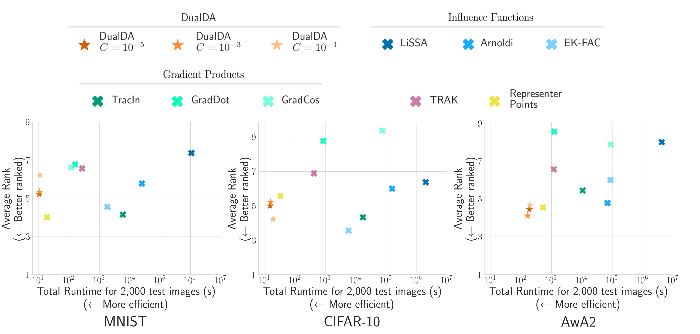
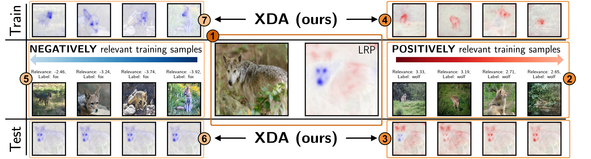

# DualXDA: Towards Sparse, Efficient and Explainable Data Attribution in Large AI Models
This repository implements the experiments for the paper **DualXDA: Towards Sparse, Efficient and Explainable Data Attribution in Large AI Models**

**DualXDA** is a framework for sparse, efficient and explainable Data Attribution. It is comprised of two interlinked approaches for Dual Data Attribution (**DualDA**) and eXplainable Data Attribution (**XDA**):

With DualDA, we propose a novel approach for efficient and effective DA, leveraging Support Vector Machine theory to provide fast and naturally sparse data attributions for AI predictions. 



We further introduce XDA, a method for enhancing Data Attribution with capabilities from feature attribution methods to explain __why__ training samples are relevant for the prediction of a test sample in terms of impactful features.




This repository contains the code used to generate and evaluate post-hoc local data attribution of torch models using seven evaluation criteria and against eight explanation methods. These include three different approximations of Influence Functions, TRAK, TracIn and Representer Point Selection. [`sklearn`](https://scikit-learn.org/) has been used for DualDA explanations.

# Getting Started
To start explaining predictions with DualDA, you first need to install the modified `sklearn` library by running

```bash
pip install ./scikit-learn-dual
```

Then, given a classification dataset `train` and a corresponding `model`, you can start attributing the model predictions on a test dataset `test` with DualDA:
```python
from explainers import DualDA

C = 0.001
device = "cuda"
cache_dir = "<cache_dir_for_dualDA>"
features_dir = "<cache_dir_for_features>"
explainer = DualDA(
    model,
    train,
    device=device,
    dir=cache_dir,
    features_dir=features_dir,
    C=C)
ldr = torch.utils.data.DataLoader(test, batch_size=True, shuffle=False)
for (x, y) in ldr:
    preds = model(x).argmax(dim=-1)
    attributions = explainer.explain(x, preds)

```

# Evaluation of DA methods
In this section, we explain how to reproduce the results in our paper.

The evaluation is conducted in five steps:
1. Generate configuration files for the following steps
2. Train or download checkpoints 
3. Generate explainer caches
4. Generate explanations

These steps are done four times, using different modifications of the same datasets. These correspond to the following keywords in our code:
"std" for vanilla dataset, "group" for modified dataset with superclasses, "corrupt" for a dataset with corrupt labels and "mark" for a dataset with shortcut features.

Finally, we have the last step

5. Evaluate the explanations with metrics

which uses the correct dataset type and reads the correspoinding explanations for each metric.

## 1. Generating configuration files

All of our scripts work with .yaml files that specify the details of the required computation. These are generated with the ipynb files in the `config_files` directory. 

Open each notebook and replace the `<data_root>` placeholder with the directory where you keep the associated datasets. You can then run the notebook to generate configuration files.

## 2. Download checkpoints

To reproduce our results exactly, you are advised to download the pretrained checkpoints for MNIST, CIFAR-10 and AwA2 datasets with the following link:

** URL will be provided for the camera ready version. Unfortunately, the checkpoints are too big to host in an anonymous fashion. **

Alternatively, you can train new models using the training configuration files:

```bash
    cd src
    python train.py --config_file config_files/train/< dataset_name >/< configuration_file_name >
```
## 3. Generate Caches for Explainers
Except for LiSSA, our explainers require a cache. However, note that computing the cache for the TracIn method will compute the caches required for GradDot and GradCos. Finally, we use the `explain.py` script **with the caching configurations** to compute caches:

To start computing the caches, run

```bash
    cd src
    python explain.py --config_file config_files/cache/< dataset_name >/< configuration_file_name >
```

## 4. Generate Explanations
Once you have the checkpoints and required caches, you can start generating data attributions:

```bash
    cd src
    python explain.py --config_file config_files/explain/< dataset_name >/< configuration_file_name >
```

Note that running the `explain.py` script for the `corrupt` dataset/model will compute self-attributions of training points, instead of attributing the test data predictions.

## 5. Evaluate Explanation Quality
Evaluation is done using the evaluate.py script and the results will be stored in the *results* folder.

```bash
    cd src
    python explain.py --config_file config_files/evaluate/< dataset_name >/< configuration_file_name >
```
